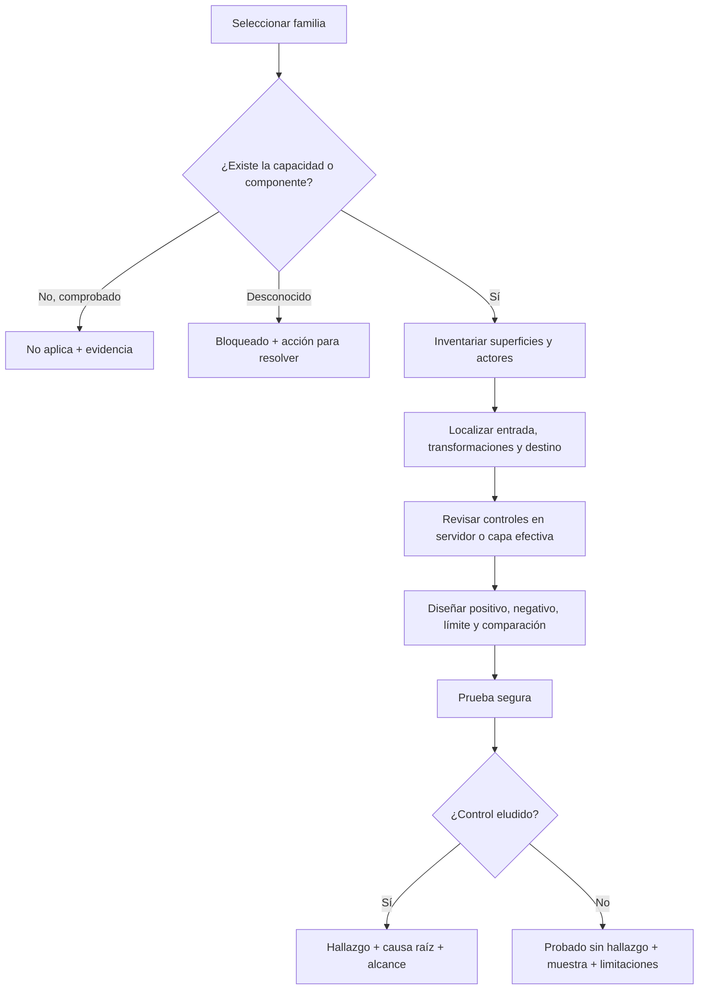

# Motor de decisión de aplicabilidad

## Decisión universal

## Preguntas de activación por capacidad

| Capacidad observada | Familias que deben activarse | Evidencia válida para descartarlas |
|---|---|---|
| Identidades, login o recuperación | Enumeración, credential stuffing, MFA, recuperación, session fixation, takeover | Confirmación de que el producto no gestiona identidad ni confía en identidad externa |
| Objetos pertenecientes a usuarios o tenants | IDOR/BOLA, escalada horizontal, aislamiento multitenant, mass assignment | Ausencia demostrada de propiedad, roles y separación lógica |
| Roles o funciones administrativas | BFLA, escalada vertical, forced browsing, confused deputy | Matriz de permisos y arquitectura que demuestren un único nivel de privilegio |
| Estado, saldo, cuota, pedido o aprobación | Workflow bypass, replay, race, TOCTOU, idempotencia, manipulación de cantidades | Flujo puramente informativo, sin transición ni efecto persistente |
| Entrada hacia consultas o intérpretes | SQL/NoSQL/LDAP/XPath/ORM/Cypher, command injection, SSTI, expression injection | Trazabilidad que demuestre que ninguna entrada controlable alcanza esos destinos |
| Datos mostrados en navegador | XSS, HTML/CSS injection, DOM clobbering, CSP bypass | Salida no interpretada en contexto activo y encoding contextual confirmado |
| Cookies o credenciales automáticas | CSRF, SameSite, fijación, robo o confusión de sesión | API sin credenciales ambientales y autenticación únicamente explícita por petición |
| Orígenes cruzados, iframes o mensajes | CORS, clickjacking, postMessage, XS-Leaks | Función no consumible desde navegador o sin cruce de origen/contexto |
| REST, GraphQL, gRPC o SOAP | BOLA/BFLA, mass assignment, batching, complejidad, parser differential, XXE | Protocolo o interfaz inexistente y comprobado en inventario |
| OAuth, OIDC o SAML | redirect URI, state/nonce/PKCE, token confusion, signature wrapping, account linking | Federación inexistente, incluidos entornos y clientes alternativos |
| Upload, importación, exportación o conversión | Upload inseguro, traversal, Zip Slip, XXE, fórmulas, parser bugs, contenido activo | Producto sin recepción ni generación de ficheros controlables |
| Fetch de URL, preview, webhook o callback | SSRF, redirect bypass, DNS rebinding, replay, firma débil | Sin solicitudes salientes basadas en datos controlables |
| CDN, WAF, proxy, gateway o caché compartida | Smuggling, desync, cache poisoning/deception, normalización diferencial | Una única capa HTTP sin traducción ni caché compartida, comprobada en arquitectura |
| Tokens, secretos, firmas o cifrado | Entropía, almacenamiento, rotación, downgrade, nonce reuse, integrity bypass | Ausencia real de secretos o requisitos de confidencialidad/integridad |
| Dependencias, plugins, paquetes o pipelines | CVE alcanzable, dependency confusion, secretos CI/CD, artefactos no firmados | Producto sin software de terceros ni proceso de build, situación excepcional documentada |
| Regex, búsquedas, informes, colas o trabajos caros | ReDoS, resource exhaustion, amplification, queue abuse | Operación acotada offline sin entrada controlable ni recurso compartido |
| Puertos o protocolos no HTTP | Defaults, acceso anónimo, downgrade, exposición de gestión, segmentación | Inventario y escaneo autorizado confirman ausencia de esos servicios |
| Cloud, metadata o identidades de workload | IAM, bucket exposure, SSRF a metadata, trust cross-account, secretos | Despliegue confirmado fuera de cloud y sin servicios equivalentes |
| Contenedores o Kubernetes | Privileged, socket/runtime, RBAC, secrets, escape, network policy | Despliegue sin contenedores ni orquestador |
| Android, iOS, escritorio o extensión | Storage, deep links, exported components, IPC, WebView, update, permisos | El producto carece de esos clientes, incluidos clientes internos |
| LLM, RAG, MCP, plugins o agentes | Prompt injection, tool abuse, RAG ACL, data leakage, excessive agency | Ningún modelo o agente procesa datos o decide/ejecuta acciones |

## Regla de exhaustividad

No existe una lista finita capaz de garantizar literalmente “todas las vulnerabilidades futuras”. La cobertura completa se obtiene combinando:

1. Catálogo de familias conocidas.
2. Inventario de todas las capacidades del producto.
3. Trazado de cada entrada hasta cada destino y frontera.
4. Modelado de estados, actores y confianza.
5. Revisión específica de tecnología, versión y configuración.
6. Búsqueda de CVE/CWE y advisories aplicables al inventario confirmado.
7. Registro explícito de cobertura, incertidumbre y riesgo residual.

Una capacidad nueva o tecnología no catalogada genera una nueva rama de análisis, no un descarte automático.
