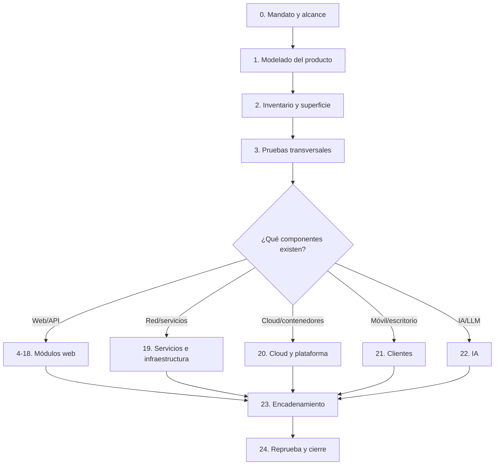

# 🧭 Mapa maestro de análisis de vulnerabilidades

> **IMPORTANTE: Objetivo**
> Guiar una evaluación autorizada de principio a fin sin saltos, obligando al evaluador a decidir qué pruebas aplican, cuáles no aplican y qué evidencia respalda cada conclusión.

> **ADVERTENCIA: Uso autorizado y seguro**
> Ejecutar únicamente sobre activos incluidos en el alcance y con autorización escrita. Acordar ventanas, límites de carga, contactos de emergencia y reglas específicas para producción. Las pruebas destructivas, de denegación de servicio, ingeniería social, persistencia o acceso a datos reales requieren autorización expresa adicional.

## 0. Cómo utilizar este mapa

Este documento no debe recorrerse como una lista plana de ataques. Se sigue en este orden:



### Regla de avance

Para cada control se registra exactamente uno de estos estados:

- [ ] **Pendiente**: aún no evaluado.
- [ ] **Aplica**: existe la precondición y debe probarse.
- [ ] **No aplica**: la precondición no existe; anotar evidencia, no solo “N/A”.
- [ ] **Probado sin hallazgo**: indicar cobertura, identidad, muestra y limitaciones.
- [ ] **Hallazgo**: vincular evidencia y ficha de vulnerabilidad.
- [ ] **Bloqueado**: explicar dependencia, falta de acceso o riesgo operativo.

> **CONSEJO: Criterio para “No aplica”**
> Una vulnerabilidad no deja de aplicar porque una prueba rápida no funcione. Solo es “No aplica” cuando no existe el componente, flujo, intérprete, frontera de confianza o capacidad necesaria. Si existe pero no se consiguió demostrar, el estado correcto suele ser “Probado sin hallazgo” o “Bloqueado”.

### Registro mínimo por prueba

```yaml
id: TEST-WEB-000
fecha: YYYY-MM-DD
componente: ""
endpoint_o_flujo: ""
identidad: anonimo|usuario_a|usuario_b|admin|servicio
precondicion: ""
estado: pendiente|aplica|no_aplica|sin_hallazgo|hallazgo|bloqueado
tecnica: manual|DAST|SAST|SCA|revision_config|entrevista
entrada_controlada: ""
resultado_esperado: ""
resultado_observado: ""
evidencia: "ruta/captura-o-peticion"
limitaciones: ""
hallazgo_relacionado: ""
```

---
date: 2026-10-06 10:35:00 +0200
categories: [Metodología, Análisis de vulnerabilidades]
tags: [pentesting, appsec, seguridad, owasp, metodologia]
pin: false

# Fase 0. Mandato, seguridad y alcance

## 0.1 Reglas de compromiso

- [ ] Identificar propietario del producto y responsable técnico.
- [ ] Documentar dominios, IP, aplicaciones, API, apps, repositorios, cuentas cloud y terceros incluidos.
- [ ] Documentar exclusiones explícitas.
- [ ] Definir ambientes: producción, preproducción, laboratorio.
- [ ] Definir fechas, horarios, IP de origen y canales de comunicación.
- [ ] Acordar límites de tasa y concurrencia.
- [ ] Acordar qué datos pueden verse, modificarse o descargarse.
- [ ] Prohibir por defecto DoS, borrado, persistencia, phishing y movimiento lateral.
- [ ] Definir “stop conditions”: degradación, alertas, datos sensibles, impacto a terceros.
- [ ] Confirmar copias de seguridad y procedimiento de recuperación cuando proceda.
- [ ] Definir retención y cifrado de evidencias.
- [ ] Preparar cuentas: anónima, usuario A, usuario B de otro tenant, rol privilegiado y cuenta bloqueada.

## 0.2 Entregables y severidad

- [ ] Acordar método de valoración: CVSS v4.0 más impacto de negocio.
- [ ] Separar severidad técnica, probabilidad, exposición e impacto empresarial.
- [ ] Definir formato de hallazgo, evidencia, recomendación y reprueba.
- [ ] Definir tratamiento de duplicados y riesgos aceptados.

### Puerta G0

No comenzar pruebas activas hasta tener alcance, autorización, contactos, límites operativos y cuentas de prueba.

---
date: 2026-10-06 10:35:00 +0200
categories: [Metodología, Análisis de vulnerabilidades]
tags: [pentesting, appsec, seguridad, owasp, metodologia]
pin: false

# Fase 1. Comprender el producto antes de atacar

## 1.1 Ficha del producto

- [ ] Propósito y procesos de negocio críticos.
- [ ] Tipos de usuarios, roles, organizaciones y tenants.
- [ ] Datos tratados: públicos, internos, personales, credenciales, financieros, salud, secretos.
- [ ] Canales: navegador, API, móvil, escritorio, CLI, webhooks, importaciones, correo.
- [ ] Arquitectura: frontend, gateway, backend, colas, bases de datos, almacenamiento, proveedores.
- [ ] Tecnologías y versiones confirmadas.
- [ ] Dependencias, plugins y servicios SaaS.
- [ ] Autenticación: local, LDAP, SAML, OAuth/OIDC, passkeys, certificados, API keys.
- [ ] Despliegue: on-premise, IaaS, PaaS, Kubernetes, serverless, CDN/WAF.
- [ ] Operaciones privilegiadas y procesos irreversibles.

## 1.2 Diagrama de flujo de datos y fronteras de confianza

Dibujar al menos:

1. Actores externos e internos.
2. Entradas y salidas.
3. Procesos y almacenes.
4. Servicios de terceros.
5. Fronteras entre Internet, edge, aplicación, administración, datos y cloud.
6. Flujos de secretos y tokens.

## 1.3 Modelado de amenazas

Aplicar STRIDE por componente:

- **S, suplantación**: robo de sesión, credenciales, tokens, identidad federada.
- **T, manipulación**: parámetros, objetos, archivos, mensajes, builds, webhooks.
- **R, repudio**: acciones sin trazabilidad o logs manipulables.
- **I, divulgación**: datos, errores, backups, metadatos, secretos.
- **D, denegación**: recursos caros, colas, regex, cargas, bloqueos.
- **E, elevación**: rol, tenant, plano de administración, host o cloud.

### Preguntas de negocio obligatorias

- [ ] ¿Qué acción produce dinero, crédito, privilegios o pérdida irreversible?
- [ ] ¿Qué operación confía en datos suministrados por el cliente?
- [ ] ¿Qué flujo requiere varias etapas y puede saltarse o repetirse?
- [ ] ¿Qué separación debe existir entre usuarios, organizaciones o regiones?
- [ ] ¿Qué callback, webhook o integración cambia el estado de una operación?
- [ ] ¿Qué sucede si dos peticiones válidas llegan simultáneamente?

### Puerta G1

No empezar fuzzing general hasta disponer de arquitectura, actores, activos críticos y fronteras de confianza. Sin ello se prueban payloads, no riesgos.

---
date: 2026-10-06 10:35:00 +0200
categories: [Metodología, Análisis de vulnerabilidades]
tags: [pentesting, appsec, seguridad, owasp, metodologia]
pin: false

# Fase 2. Inventario de superficie de ataque

## 2.1 Descubrimiento pasivo

- [ ] Dominios, subdominios, ASN/IP autorizadas y certificados.
- [ ] DNS: A/AAAA, CNAME, MX, TXT, NS, CAA y delegaciones.
- [ ] Tecnologías expuestas en headers, HTML, JavaScript, iconos y errores.
- [ ] Repositorios, paquetes, documentación, Swagger/OpenAPI, GraphQL y SDK públicos.
- [ ] Historial de endpoints, archivos y subdominios retirados.
- [ ] Secretos o configuraciones publicados accidentalmente.
- [ ] Dependencias de terceros y riesgo de subdomain takeover.

## 2.2 Descubrimiento activo controlado

- [ ] Hosts, puertos y protocolos autorizados.
- [ ] Virtual hosts, redirects, aliases y rutas base.
- [ ] Directorios, ficheros, backups, source maps y endpoints ocultos.
- [ ] Métodos HTTP y tipos de contenido aceptados.
- [ ] Parámetros en URL, body, JSON, XML, multipart, cookies y headers.
- [ ] WebSockets, SSE, gRPC, webhooks y canales asíncronos.
- [ ] Paneles de administración, health, metrics, debug y observabilidad.
- [ ] Funciones accesibles tras autenticación por cada rol.

## 2.3 Matriz de superficie

| ID | Componente | Entrada | Actor mínimo | Datos | Frontera | Tecnología | Criticidad | Módulos aplicables |
|---|---|---|---|---|---|---|---|---|
| SURF-001 | Ejemplo API pagos | `POST /api/payments` | usuario | financiero | Internet → API | REST/JSON | crítica | authz, lógica, race, inyección |

### Puerta G2

Cada endpoint o función crítica debe tener actor, dato, frontera y módulos de prueba asociados. Lo no inventariado no puede considerarse cubierto.

---
date: 2026-10-06 10:35:00 +0200
categories: [Metodología, Análisis de vulnerabilidades]
tags: [pentesting, appsec, seguridad, owasp, metodologia]
pin: false

# Fase 3. Baseline y configuración transversal

## 3.1 Transporte y HTTP

- [ ] HTTPS forzado y ausencia de mixed content.
- [ ] Protocolos y cifrados TLS adecuados; certificados, cadena, hostname y renovación.
- [ ] HSTS consistente en dominios aplicables.
- [ ] Headers: CSP, frame-ancestors/X-Frame-Options, nosniff, Referrer-Policy y Permissions-Policy.
- [ ] Política de caché para respuestas sensibles.
- [ ] CORS por endpoint, método, credenciales y origen.
- [ ] Métodos HTTP innecesarios deshabilitados.
- [ ] Host header y URLs absolutas generadas de forma segura.
- [ ] Normalización coherente entre CDN, proxy, WAF, gateway y backend.

## 3.2 Exposición y endurecimiento

- [ ] Sin banners, versiones, stack traces o comentarios sensibles.
- [ ] Sin listados de directorio, backups, `.git`, `.env`, logs o dumps.
- [ ] Debug, profiling, Swagger, Actuator, metrics y consolas protegidos.
- [ ] Cuentas, rutas y credenciales por defecto eliminadas.
- [ ] Separación del plano de administración.
- [ ] Mensajes de error genéricos hacia cliente y detalle solo en logs.
- [ ] Límites de body, headers, archivos, profundidad JSON/XML y tiempo de proceso.

---
date: 2026-10-06 10:35:00 +0200
categories: [Metodología, Análisis de vulnerabilidades]
tags: [pentesting, appsec, seguridad, owasp, metodologia]
pin: false

# Fase 4. Identidad, registro y recuperación

## 4.1 Registro y enumeración

- [ ] Enumeración por respuesta, tiempo, código, captcha o recuperación.
- [ ] Verificación de correo/teléfono y posibilidad de cambiar el destino durante el flujo.
- [ ] Duplicados, normalización Unicode, mayúsculas, espacios y alias de correo.
- [ ] Asignación de rol, tenant, plan, saldo o atributos manipulables.
- [ ] Invitaciones: caducidad, destinatario, un solo uso, tenant y privilegio.
- [ ] Prevención de registro con dominios o identidades reservadas.

## 4.2 Contraseñas y autenticación

- [ ] Política razonable de longitud y comprobación frente a contraseñas comprometidas.
- [ ] Sin truncado silencioso ni normalización inconsistente.
- [ ] Rate limiting por cuenta, IP, dispositivo y riesgo, evitando bloqueo abusivo.
- [ ] MFA: inscripción, reto, recuperación, cambio y desactivación.
- [ ] Códigos OTP impredecibles, caducidad, un solo uso y límites de intento.
- [ ] “Recordar dispositivo” vinculado y revocable.
- [ ] Reautenticación para acciones sensibles.
- [ ] Resistencia a credential stuffing sin crear DoS de bloqueo.

## 4.3 Recuperación de cuenta

- [ ] Token aleatorio, de alta entropía, corto, de un solo uso y ligado a usuario/propósito.
- [ ] No filtrado en URL, Referer, logs, analytics o terceros.
- [ ] Host header no controla el enlace de recuperación.
- [ ] Cambiar contraseña invalida sesiones y tokens según política.
- [ ] Cambio de email/teléfono exige autenticación fuerte y notifica al canal anterior.
- [ ] Flujos de soporte no permiten saltar controles.

---
date: 2026-10-06 10:35:00 +0200
categories: [Metodología, Análisis de vulnerabilidades]
tags: [pentesting, appsec, seguridad, owasp, metodologia]
pin: false

# Fase 5. Sesiones, cookies y tokens

- [ ] Identificador de sesión impredecible y rotado tras login o elevación.
- [ ] Cookies con Secure, HttpOnly, SameSite, Path y Domain mínimos.
- [ ] Sin session fixation ni adopción de identificador aportado por atacante.
- [ ] Logout invalida servidor, no solo borra cliente.
- [ ] Caducidad absoluta e inactividad coherentes con el riesgo.
- [ ] Sesiones revocables y visibles cuando el producto lo requiera.
- [ ] Cambio de rol/tenant no conserva autorizaciones antiguas.
- [ ] Tokens no aparecen en URL, logs, almacenamiento inseguro o mensajes de error.
- [ ] JWT: algoritmo fijado, firma verificada, issuer, audience, exp, nbf, jti y rotación de claves.
- [ ] Refresh tokens rotados, con detección de reutilización y revocación.
- [ ] API keys con alcance, expiración, rotación y último uso.

---
date: 2026-10-06 10:35:00 +0200
categories: [Metodología, Análisis de vulnerabilidades]
tags: [pentesting, appsec, seguridad, owasp, metodologia]
pin: false

# Fase 6. Autorización y aislamiento

> **PELIGRO: Prioridad máxima**
> Probar siempre con al menos dos usuarios equivalentes, dos roles distintos y, si existe multitenancy, dos organizaciones diferentes.

## 6.1 Matriz de autorización

| Función/objeto | Anónimo | Usuario A | Usuario B | Admin tenant A | Admin global | Servicio |
|---|---:|---:|---:|---:|---:|---:|
| Leer objeto propio | | | | | | |
| Leer objeto ajeno | | | | | | |
| Modificar objeto | | | | | | |
| Exportar/borrar | | | | | | |

## 6.2 Pruebas

- [ ] Acceso forzado a rutas sin autenticación.
- [ ] IDOR/BOLA al cambiar ID, UUID, slug, nombre, ruta o referencia indirecta.
- [ ] Escalada horizontal entre usuarios.
- [ ] Escalada vertical entre roles.
- [ ] Aislamiento entre tenants en lectura, escritura, búsqueda, exportación, archivos y cache.
- [ ] Autorización en backend, no solo ocultación de interfaz.
- [ ] Métodos alternativos y versiones antiguas mantienen controles.
- [ ] Operaciones batch verifican autorización por cada objeto.
- [ ] Mass assignment no permite cambiar rol, owner, tenant, precio o estado.
- [ ] Recursos hijos no heredan acceso indebidamente.
- [ ] WebSockets, webhooks y jobs asíncronos aplican la misma autorización.
- [ ] URLs firmadas limitan recurso, acción, usuario y tiempo.
- [ ] Búsquedas, contadores y mensajes no filtran existencia de objetos ajenos.

---
date: 2026-10-06 10:35:00 +0200
categories: [Metodología, Análisis de vulnerabilidades]
tags: [pentesting, appsec, seguridad, owasp, metodologia]
pin: false

# Fase 7. Lógica de negocio y estados

- [ ] Dibujar máquina de estados para cada flujo crítico.
- [ ] Saltar pasos, invertir orden o llamar directamente al paso final.
- [ ] Repetir acciones de un solo uso: cupón, reembolso, voto, invitación, aprobación.
- [ ] Modificar precio, cantidad, moneda, impuestos, descuento, plan o beneficiario.
- [ ] Valores cero, negativos, extremos, decimales, redondeos y overflow.
- [ ] Confusión entre estado mostrado y estado persistido.
- [ ] Cancelar o cambiar una operación después de autorizarla.
- [ ] Reutilizar callbacks, nonces, referencias o enlaces antiguos.
- [ ] Confiar en estados, claims o totales calculados por cliente.
- [ ] Separación de funciones y doble aprobación.
- [ ] Abuso de pruebas gratuitas, referidos, límites o promociones.
- [ ] Falta de idempotencia en operaciones financieras o irreversibles.
- [ ] Race conditions con peticiones sincronizadas y repetición controlada.
- [ ] TOCTOU entre validación y uso.

---
date: 2026-10-06 10:35:00 +0200
categories: [Metodología, Análisis de vulnerabilidades]
tags: [pentesting, appsec, seguridad, owasp, metodologia]
pin: false

# Fase 8. Validación de entradas e inyecciones

## 8.1 Localizar “sinks” antes de probar

Marcar cada entrada que alcance:

- Consultas SQL, NoSQL, LDAP, XPath, ORM o motores de búsqueda.
- Shell, procesos, argumentos, rutas o intérpretes.
- Plantillas, expresiones, reglas, filtros o fórmulas.
- HTML/DOM, JavaScript, CSS, URL o headers.
- Parsers XML, YAML, CSV, documentos, imágenes o conversores.
- Serializadores/deserializadores.
- Logging, correo, PDF, impresión o sistemas downstream.

## 8.2 Familias de pruebas

- [ ] SQL injection: error, boolean, tiempo, unión y segundo orden según contexto.
- [ ] NoSQL/operator injection y confusión de tipos.
- [ ] Command/argument injection con pruebas inocuas.
- [ ] LDAP, XPath, ORM, Cypher y búsquedas.
- [ ] SSTI y lenguajes de expresión.
- [ ] XSS reflejado, almacenado, DOM y contextos especiales.
- [ ] HTML/CSS/CSV/formula/email/header injection.
- [ ] CRLF y response splitting.
- [ ] XXE solo si existe parser XML y con entidad segura/OAST autorizado.
- [ ] Deserialización insegura según formato y plataforma.
- [ ] Prototype/class pollution.
- [ ] ReDoS con límites estrictos y preferencia por análisis offline.
- [ ] Unicode, canonicalización, encoding múltiple, null bytes y discrepancias de parser.

### Método por parámetro

1. Confirmar tipo y contexto.
2. Establecer respuesta baseline.
3. Introducir marcador único no destructivo.
4. Observar transformación, error, tiempo y destino.
5. Probar variantes específicas del contexto.
6. Confirmar con segundo indicador independiente.
7. Minimizar PoC e impacto.

---
date: 2026-10-06 10:35:00 +0200
categories: [Metodología, Análisis de vulnerabilidades]
tags: [pentesting, appsec, seguridad, owasp, metodologia]
pin: false

# Fase 9. Navegador y cliente web

- [ ] XSS por contexto y recorridos source-to-sink.
- [ ] DOM clobbering y prototype pollution cuando el JavaScript lo permita.
- [ ] CSP efectiva, no solo presente.
- [ ] Clickjacking en acciones sensibles.
- [ ] CSRF en toda operación con credenciales automáticas.
- [ ] CORS con orígenes reflejados, null, subdominios y credenciales.
- [ ] postMessage: origin exacto, source, formato y datos sensibles.
- [ ] Open redirect y su encadenamiento con OAuth, SSO o phishing.
- [ ] Reverse tabnabbing y enlaces externos.
- [ ] Service workers: alcance, cache, actualización y registro.
- [ ] localStorage/sessionStorage/IndexedDB sin secretos innecesarios.
- [ ] Source maps y JavaScript revelan rutas, claves o lógica privilegiada.
- [ ] WebSockets: autenticación, autorización por mensaje, Origin, sesión y límites.
- [ ] Cache deception/poisoning y claves de cache inconsistentes.

---
date: 2026-10-06 10:35:00 +0200
categories: [Metodología, Análisis de vulnerabilidades]
tags: [pentesting, appsec, seguridad, owasp, metodologia]
pin: false

# Fase 10. APIs: REST, GraphQL, gRPC y SOAP

## 10.1 API general

- [ ] Inventario de versiones, rutas y documentación divergente.
- [ ] BOLA, BFLA y autorización por propiedad.
- [ ] Mass assignment y propiedades ocultas.
- [ ] Validación de Content-Type y parser differential.
- [ ] Paginación, filtros y exportaciones sin extracción masiva.
- [ ] Límites por consumidor, token, función y coste.
- [ ] Respuestas no exponen campos internos.
- [ ] Versiones antiguas y endpoints móviles mantienen controles.
- [ ] Idempotency keys ligadas a actor, operación y contenido.

## 10.2 GraphQL

- [ ] Introspection según entorno y exposición prevista.
- [ ] Autorización por resolver y objeto.
- [ ] Aliases, batching y fragments no eluden límites.
- [ ] Profundidad, complejidad y coste limitados.
- [ ] Mutaciones y suscripciones protegidas.
- [ ] Errores no revelan esquema o internals indebidamente.

## 10.3 gRPC/SOAP

- [ ] Reflection y descriptores expuestos solo si procede.
- [ ] Metadatos y autorización por método.
- [ ] Tamaños, streaming y deadlines limitados.
- [ ] SOAPAction, XML parser, WS-Security y firmas correctamente validadas.

---
date: 2026-10-06 10:35:00 +0200
categories: [Metodología, Análisis de vulnerabilidades]
tags: [pentesting, appsec, seguridad, owasp, metodologia]
pin: false

# Fase 11. OAuth 2.0, OpenID Connect, SAML y SSO

## 11.1 OAuth/OIDC

- [ ] redirect_uri exacta, registrada y sin comodines peligrosos.
- [ ] state ligado a sesión y de un solo uso.
- [ ] nonce validado en OIDC.
- [ ] PKCE S256, especialmente clientes públicos.
- [ ] issuer y audience estrictos.
- [ ] No aceptar tokens de otro cliente, tenant o entorno.
- [ ] Account linking exige identidad autenticada y evita pre-hijacking.
- [ ] Scopes mínimos y consentimiento comprensible.
- [ ] Tokens no filtrados por front-channel, logs o Referer.
- [ ] Cierre de sesión y revocación con comportamiento conocido.

## 11.2 SAML

- [ ] Firma obligatoria sobre el elemento consumido.
- [ ] InResponseTo, Destination, Recipient, Audience y temporalidad.
- [ ] Protección contra signature wrapping y respuesta/assertion ambiguas.
- [ ] RelayState controlado.
- [ ] Mapeo seguro de atributos, tenant y rol.
- [ ] Certificados y metadatos con rotación controlada.

---
date: 2026-10-06 10:35:00 +0200
categories: [Metodología, Análisis de vulnerabilidades]
tags: [pentesting, appsec, seguridad, owasp, metodologia]
pin: false

# Fase 12. Archivos, rutas y contenido activo

## 12.1 Upload

- [ ] Extensión, MIME declarado, MIME real y firma mágica.
- [ ] Nombre generado por servidor y sin traversal.
- [ ] Almacenamiento fuera del webroot o en dominio aislado.
- [ ] Descarga con Content-Disposition y nosniff.
- [ ] SVG, HTML, PDF y documentos tratados como contenido activo.
- [ ] Imágenes/documentos se reprocesan de forma segura.
- [ ] Antivirus/sandbox no sustituye las validaciones.
- [ ] Límites de tamaño, cantidad, dimensiones, páginas y compresión.
- [ ] ZIP bombs, archivos anidados y symlinks.
- [ ] Reemplazo, overwrite, deduplicación y autorización.
- [ ] Estado de cuarentena no accesible antes del análisis.

## 12.2 Rutas, inclusión y extracción

- [ ] Path traversal en lectura, escritura, borrado y descarga.
- [ ] Rutas absolutas, separadores alternativos, encoding y normalización.
- [ ] LFI/RFI solo donde exista inclusión o lectura dinámica.
- [ ] Zip Slip y extracción segura.
- [ ] Symlink/hardlink y carreras de archivos.
- [ ] Nombres reservados y diferencias Windows/Linux.

---
date: 2026-10-06 10:35:00 +0200
categories: [Metodología, Análisis de vulnerabilidades]
tags: [pentesting, appsec, seguridad, owasp, metodologia]
pin: false

# Fase 13. Solicitudes salientes, URLs, webhooks y SSRF

- [ ] Identificar importadores URL, previews, PDFs, imágenes, feeds, webhooks y callbacks.
- [ ] Protocolos permitidos mediante allowlist.
- [ ] Validación tras cada redirect.
- [ ] Resolución DNS y conexión verifican el mismo destino.
- [ ] Bloqueo de loopback, privados, link-local, multicast y metadata cloud.
- [ ] IPv4/IPv6 y representaciones alternativas.
- [ ] Credenciales en URL y confusión de userinfo/host.
- [ ] Sin acceso a Unix sockets, file, gopher u otros esquemas no requeridos.
- [ ] Egress mínimo y proxy controlado.
- [ ] Respuestas, tiempos y errores no convierten el servicio en escáner.
- [ ] Webhooks firmados, con timestamp, replay protection y rotación de secreto.
- [ ] Callbacks no cambian estado sin verificar autenticidad y correlación.

---
date: 2026-10-06 10:35:00 +0200
categories: [Metodología, Análisis de vulnerabilidades]
tags: [pentesting, appsec, seguridad, owasp, metodologia]
pin: false

# Fase 14. Proxies, caché y discrepancias HTTP

Estas pruebas solo se realizan con autorización y límites estrictos:

- [ ] Cadena exacta: CDN → WAF → reverse proxy → gateway → aplicación.
- [ ] Normalización de path, host, query, headers y encoding.
- [ ] Hop-by-hop headers eliminados correctamente.
- [ ] Request smuggling/desync: priorizar pruebas de detección no disruptivas.
- [ ] HTTP/2 downgrade y traducciones de protocolo.
- [ ] Cache key incluye los elementos que cambian contenido o autorización.
- [ ] Respuestas privadas no se almacenan como públicas.
- [ ] Cache poisoning/deception y variantes por path/query/header.
- [ ] 401/403 no son el único control y no se eluden por discrepancias de ruta.

---
date: 2026-10-06 10:35:00 +0200
categories: [Metodología, Análisis de vulnerabilidades]
tags: [pentesting, appsec, seguridad, owasp, metodologia]
pin: false

# Fase 15. Criptografía, secretos e integridad

- [ ] Algoritmos y modos estándar, sin criptografía casera.
- [ ] Aleatoriedad criptográfica para tokens, nonces y claves.
- [ ] Contraseñas con función adaptativa y sal única.
- [ ] Claves fuera del código, imágenes, repositorios y logs.
- [ ] KMS/HSM o almacén equivalente cuando el riesgo lo exige.
- [ ] Rotación, versión, revocación y recuperación de claves.
- [ ] Separación entre cifrado, firma y tokenización.
- [ ] AEAD y validación de integridad antes de procesar.
- [ ] Nonces/IV no reutilizados donde resulte crítico.
- [ ] Firmas verifican canonicalización, algoritmo, clave y contexto.
- [ ] Datos sensibles cifrados en tránsito y reposo según amenaza.
- [ ] Backups, exports y colas incluidos en el modelo criptográfico.

---
date: 2026-10-06 10:35:00 +0200
categories: [Metodología, Análisis de vulnerabilidades]
tags: [pentesting, appsec, seguridad, owasp, metodologia]
pin: false

# Fase 16. Dependencias, cadena de suministro y CI/CD

- [ ] SBOM y versiones directas/transitivas.
- [ ] SCA contrastada con alcanzabilidad y configuración real.
- [ ] Dependencias fijadas por lockfile y hashes cuando aplique.
- [ ] Repositorios de paquetes restringidos; prevención de dependency confusion.
- [ ] Paquetes y mantenedores abandonados identificados.
- [ ] Plugins, temas, imágenes y actions revisados.
- [ ] Secret scanning en historial, no solo rama actual.
- [ ] Pipelines con permisos mínimos y ambientes protegidos.
- [ ] Pull requests de forks no acceden a secretos.
- [ ] Artefactos firmados y procedencia verificable.
- [ ] Imágenes base mínimas, actualizadas y por digest.
- [ ] Separación build/deploy y aprobación para producción.
- [ ] Actualizador del producto verifica origen, firma y anti-rollback.

---
date: 2026-10-06 10:35:00 +0200
categories: [Metodología, Análisis de vulnerabilidades]
tags: [pentesting, appsec, seguridad, owasp, metodologia]
pin: false

# Fase 17. Disponibilidad y condiciones excepcionales

> **ADVERTENCIA: Validar preferentemente mediante revisión, laboratorio o límites bajos. No ejecutar pruebas de agotamiento en producción sin aprobación específica.**

- [ ] Límites de petición, archivo, campos, profundidad y descompresión.
- [ ] Timeouts, circuit breakers y backpressure.
- [ ] Operaciones costosas autenticadas y limitadas.
- [ ] Regex, consultas, búsquedas, informes y exportaciones acotadas.
- [ ] Colas con tamaño, reintentos, dead-letter y deduplicación.
- [ ] Errores parciales no dejan estados inseguros.
- [ ] Transacciones revierten de forma consistente.
- [ ] Fail-open/fail-closed decidido según control.
- [ ] Dependencias caídas no desactivan autorización o validación.
- [ ] Recursos temporales se limpian.
- [ ] Códigos y mensajes no filtran datos.

---
date: 2026-10-06 10:35:00 +0200
categories: [Metodología, Análisis de vulnerabilidades]
tags: [pentesting, appsec, seguridad, owasp, metodologia]
pin: false

# Fase 18. Logging, detección y respuesta

- [ ] Login, fallos, MFA, recuperación y cambios de identidad.
- [ ] Acciones administrativas y cambios de privilegio.
- [ ] Acceso, exportación y borrado de datos sensibles.
- [ ] Eventos de seguridad con actor, acción, objeto, resultado y correlación.
- [ ] Logs sin contraseñas, tokens, claves, datos completos ni payloads peligrosos.
- [ ] Protección frente a log injection.
- [ ] Hora sincronizada e integridad/retención apropiadas.
- [ ] Alertas accionables para abuso, no solo volumen.
- [ ] Trazabilidad a través de gateway, backend, jobs y terceros.
- [ ] El usuario no puede borrar o alterar evidencia de sus acciones.
- [ ] Playbooks para revocar sesiones, claves, webhooks y accesos.

---
date: 2026-10-06 10:35:00 +0200
categories: [Metodología, Análisis de vulnerabilidades]
tags: [pentesting, appsec, seguridad, owasp, metodologia]
pin: false

# Fase 19. Red y servicios

Activar este módulo por cada puerto/protocolo descubierto:

- [ ] Servicio y versión confirmados, no inferidos solo por puerto.
- [ ] Exposición necesaria y segmentación.
- [ ] Autenticación, cifrado y configuración por defecto.
- [ ] Acceso anónimo, guest o default.
- [ ] Enumeración de usuarios, recursos y metadatos.
- [ ] Permisos de lectura, escritura, administración y ejecución.
- [ ] Protocolos legados o downgrade.
- [ ] Interfaces de gestión separadas.
- [ ] Bases de datos, caches, brokers y dashboards no expuestos públicamente.
- [ ] DNS, correo, SMB, LDAP, SSH, RDP, SNMP, VPN y servicios específicos según inventario.
- [ ] IPv6 evaluado aunque el inventario principal sea IPv4.
- [ ] Filtrado de salida y alcance del movimiento lateral.

---
date: 2026-10-06 10:35:00 +0200
categories: [Metodología, Análisis de vulnerabilidades]
tags: [pentesting, appsec, seguridad, owasp, metodologia]
pin: false

# Fase 20. Cloud, contenedores y plataforma

## 20.1 Cloud

- [ ] Inventario de cuentas/proyectos/suscripciones y regiones.
- [ ] IAM: usuarios, roles, trust policies, service principals y llaves.
- [ ] Menor privilegio y separación de administración.
- [ ] Almacenamiento: acceso público, ACL/policies, URLs firmadas y cifrado.
- [ ] Secret managers y rotación.
- [ ] Metadata/IMDS protegida y riesgo SSRF.
- [ ] Security groups/firewalls y servicios administrados expuestos.
- [ ] Logs de control, datos y red habilitados.
- [ ] Cross-account/cross-tenant trust.
- [ ] Serverless: eventos, roles, dependencias y datos temporales.

## 20.2 Contenedores/Kubernetes

- [ ] Imágenes mínimas, sin secretos y por digest.
- [ ] Usuario no root, filesystem de solo lectura y capabilities mínimas.
- [ ] Sin privileged, hostPath, hostNetwork o socket del runtime salvo justificación.
- [ ] Seccomp/AppArmor/SELinux y límites de recursos.
- [ ] RBAC, service accounts y tokens.
- [ ] Secrets, etcd y admission policies.
- [ ] NetworkPolicies y egress.
- [ ] API server, kubelet, dashboards y registries protegidos.
- [ ] Aislamiento de namespaces y riesgo de escape evaluado según runtime/kernel.

---
date: 2026-10-06 10:35:00 +0200
categories: [Metodología, Análisis de vulnerabilidades]
tags: [pentesting, appsec, seguridad, owasp, metodologia]
pin: false

# Fase 21. Clientes móviles, escritorio y extensiones

## 21.1 Móvil

- [ ] Almacenamiento local, backups, logs, screenshots y portapapeles.
- [ ] TLS y validación de hostname; pinning como defensa adicional, no como sustituto.
- [ ] Deep links/universal links/app links.
- [ ] Componentes exportados, intents, providers y permisos en Android.
- [ ] URL schemes, entitlements, Keychain y pasteboard en iOS.
- [ ] WebViews, bridges JavaScript y navegación externa.
- [ ] Tokens biométricos ligados al keystore/keychain.
- [ ] Integridad/attestation entendida como señal, no autorización exclusiva.
- [ ] Binario, símbolos, secrets y endpoints embebidos.
- [ ] API backend mantiene todos los controles aunque el cliente se modifique.

## 21.2 Escritorio/Electron/extensiones

- [ ] Actualizaciones firmadas y canales protegidos.
- [ ] IPC, custom protocols y argumentos.
- [ ] Electron: contextIsolation, sandbox, nodeIntegration y preload.
- [ ] Archivos, registro, credenciales y permisos locales.
- [ ] Extensiones: permissions/host_permissions mínimos.
- [ ] Content scripts, mensajes, páginas privilegiadas y web-accessible resources.
- [ ] Native messaging y orígenes permitidos.

---
date: 2026-10-06 10:35:00 +0200
categories: [Metodología, Análisis de vulnerabilidades]
tags: [pentesting, appsec, seguridad, owasp, metodologia]
pin: false

# Fase 22. IA, LLM y agentes

Activar si el producto procesa prompts, documentos, retrieval o ejecuta herramientas:

- [ ] Prompt injection directa e indirecta.
- [ ] Separación entre instrucciones de sistema, usuario y contenido recuperado.
- [ ] Autorización independiente para cada herramienta y recurso.
- [ ] El modelo no decide por sí solo identidad, permisos ni transacciones críticas.
- [ ] Confirmación humana para acciones irreversibles.
- [ ] RAG respeta ACL por documento, tenant y fragmento.
- [ ] Prevención de exfiltración de secretos, contexto y datos de otros usuarios.
- [ ] Validación de salida antes de shell, SQL, HTML, correo o API.
- [ ] Límites de coste, tokens, concurrencia y bucles de agente.
- [ ] Envenenamiento de conocimiento, modelos, plugins o MCP.
- [ ] Logs y datasets no incorporan datos sensibles sin control.
- [ ] Evaluaciones reproducibles frente a jailbreak no sustituyen controles deterministas.

---
date: 2026-10-06 10:35:00 +0200
categories: [Metodología, Análisis de vulnerabilidades]
tags: [pentesting, appsec, seguridad, owasp, metodologia]
pin: false

# Fase 23. Encadenamiento y análisis de impacto

Después de pruebas aisladas, buscar cadenas realistas sin aumentar impacto innecesariamente:

- [ ] Divulgación → toma de cuenta.
- [ ] XSS → acción privilegiada o robo de datos accesibles.
- [ ] Open redirect → OAuth/OIDC.
- [ ] Upload → contenido activo, SSRF o procesamiento inseguro.
- [ ] SSRF → metadata cloud o servicios internos.
- [ ] IDOR → acceso masivo o cambio de tenant.
- [ ] Configuración → bypass de autenticación/autorización.
- [ ] Dependencia vulnerable → función alcanzable → impacto real.
- [ ] Race → doble gasto, doble aprobación o límite superado.
- [ ] Error de negocio → fraude repetible y escalable.

### Regla de evidencia

Demostrar el menor impacto suficiente. No descargar conjuntos completos, ejecutar comandos destructivos, mantener persistencia ni acceder a terceros para “subir” severidad.

---
date: 2026-10-06 10:35:00 +0200
categories: [Metodología, Análisis de vulnerabilidades]
tags: [pentesting, appsec, seguridad, owasp, metodologia]
pin: false

# Fase 24. Cobertura, informe, reprueba y cierre

## 24.1 Control de cobertura

- [ ] Todos los componentes de la matriz de superficie tienen resultado.
- [ ] Todas las identidades y tenants previstos fueron utilizados.
- [ ] Todos los flujos críticos tienen máquina de estados revisada.
- [ ] Cada “No aplica” contiene justificación verificable.
- [ ] Cada “Sin hallazgo” indica muestra y limitaciones.
- [ ] Cada hallazgo tiene petición/flujo mínimo reproducible.
- [ ] Los scanners fueron validados manualmente.
- [ ] Se revisaron falsos negativos probables por WAF, caché, asincronía o entorno.
- [ ] Se eliminaron datos y cuentas de prueba conforme al acuerdo.

## 24.2 Plantilla de hallazgo

```markdown
# [ID] Título orientado al impacto

## Resumen
Qué control falla, dónde y qué puede conseguir un atacante.

## Activos afectados
- Componente:
- Endpoint/versión:
- Roles/tenants:

## Precondiciones
Acceso, rol, interacción de víctima, red o configuración necesarios.

## Pasos de reproducción
1. Preparación segura.
2. Petición o acción mínima.
3. Resultado verificable.

## Evidencia
Petición/respuesta sanitizada, captura, log y marcas temporales.

## Impacto
Confidencialidad, integridad, disponibilidad y efecto de negocio.

## Probabilidad y severidad
CVSS v4.0, exposición, complejidad y justificación empresarial.

## Causa raíz
Control ausente o aplicado en la capa incorrecta.

## Recomendación
Corrección estructural, defensa adicional y prueba unitaria/integración sugerida.

## Referencias
CWE, OWASP ASVS/WSTG/API Top 10 y documentación específica.

## Reprueba
Versión, fecha, casos positivos/negativos y resultado.
```

## 24.3 Reprueba

- [ ] Reproducir el caso original.
- [ ] Añadir caso negativo y caso límite.
- [ ] Comprobar variantes equivalentes y endpoints hermanos.
- [ ] Validar que la corrección está en servidor.
- [ ] Revisar regresiones funcionales.
- [ ] Actualizar severidad solo con evidencia.
- [ ] Cerrar como corregido, parcialmente corregido, no corregido o riesgo aceptado.

---
date: 2026-10-06 10:35:00 +0200
categories: [Metodología, Análisis de vulnerabilidades]
tags: [pentesting, appsec, seguridad, owasp, metodologia]
pin: false

# Mapa de decisión rápido

| Si el producto tiene… | Activar obligatoriamente |
|---|---|
| Login o sesiones | Fases 4, 5, 6, 18 |
| Roles o multitenancy | Fase 6 con dos usuarios y dos tenants |
| Pagos, saldo, reservas o cuotas | Fases 7, 17 y 23 |
| Entrada que llega a intérprete/consulta | Fase 8 |
| JavaScript/browser | Fase 9 |
| REST/GraphQL/gRPC/SOAP | Fase 10 |
| SSO/OAuth/OIDC/SAML | Fase 11 |
| Upload/import/export | Fase 12 |
| Fetch de URL/webhook/callback | Fase 13 |
| CDN/WAF/proxies/cache | Fase 14 |
| Datos sensibles/tokens/firmas | Fase 15 |
| Dependencias o pipeline | Fase 16 |
| Servicios de red | Fase 19 |
| Cloud/Kubernetes/contenedores | Fase 20 |
| App móvil/escritorio/extensión | Fase 21 |
| LLM/RAG/agentes/herramientas | Fase 22 |

---
date: 2026-10-06 10:35:00 +0200
categories: [Metodología, Análisis de vulnerabilidades]
tags: [pentesting, appsec, seguridad, owasp, metodologia]
pin: false

# Checklist diario del evaluador

## Inicio de sesión de trabajo

- [ ] Alcance y ventana siguen vigentes.
- [ ] Proxy, reloj, almacenamiento y cifrado de evidencia preparados.
- [ ] Identidades claramente diferenciadas.
- [ ] Baseline funcional guardada.
- [ ] Límite de tasa configurado.
- [ ] Objetivo del día vinculado a una fase y superficie concretas.

## Durante las pruebas

- [ ] Una hipótesis por prueba.
- [ ] Marcadores únicos para correlación.
- [ ] Cambiar una variable cada vez.
- [ ] Guardar petición y respuesta completas sanitizadas.
- [ ] Registrar tanto éxitos como cobertura negativa.
- [ ] Detenerse al alcanzar evidencia suficiente.

## Fin de sesión

- [ ] Limpiar objetos, archivos, webhooks y cuentas temporales.
- [ ] Revocar tokens o claves creadas.
- [ ] Registrar bloqueos y siguientes pasos.
- [ ] Respaldar evidencias de modo seguro.
- [ ] Comunicar inmediatamente hallazgos críticos conforme al acuerdo.

---
date: 2026-10-06 10:35:00 +0200
categories: [Metodología, Análisis de vulnerabilidades]
tags: [pentesting, appsec, seguridad, owasp, metodologia]
pin: false

# Fuentes locales y criterio de síntesis

Esta guía se ha estructurado a partir de los materiales disponibles en la carpeta de trabajo:

- `lista_vulns.docx`, como inventario propio de vulnerabilidades y ejemplos.
- `owasp-top10/docs/es/`, como clasificación de riesgos de aplicación.
- `hacktricks/src/pentesting-web/`, como catálogo técnico web.
- `hacktricks/src/network-services-pentesting/`, para servicios y productos.
- `hacktricks/src/mobile-pentesting/`, para Android e iOS.
- `hacktricks/src/generic-methodologies-and-resources/`, para reconocimiento, modelado y metodología.
- `hacktricks/src/AI/`, para superficies de IA y agentes.

> **NOTA: Alcance de la síntesis**
> HackTricks contiene una base muy extensa y cambiante. Este mapa no copia cada técnica ni payload. Los agrupa por precondición, frontera de confianza y fase de evaluación para que el analista decida aplicabilidad sin perder el flujo. Para ejecutar una prueba concreta, consultar el documento local especializado y registrar aquí su resultado.

## Índices locales recomendados

- Web: `hacktricks/src/pentesting-web/web-vulnerabilities-methodology.md`
- API: `hacktricks/src/network-services-pentesting/pentesting-web/web-api-pentesting.md`
- Red: `hacktricks/src/generic-methodologies-and-resources/pentesting-network/README.md`
- Threat modeling: `hacktricks/src/generic-methodologies-and-resources/threat-modeling.md`
- Metodología general: `hacktricks/src/generic-methodologies-and-resources/pentesting-methodology.md`
- Android: `hacktricks/src/mobile-pentesting/android-checklist.md`
- iOS: `hacktricks/src/mobile-pentesting/ios-pentesting-checklist.md`
- OWASP Top 10 2025 ES: `owasp-top10/docs/es/index.md`

---
date: 2026-10-06 10:35:00 +0200
categories: [Metodología, Análisis de vulnerabilidades]
tags: [pentesting, appsec, seguridad, owasp, metodologia]
pin: false

# Anexo A. Hoja de control de evaluación

```markdown
# Evaluación: NOMBRE DEL PRODUCTO

## Estado
- Responsable:
- Fecha:
- Versión/commit:
- Entorno:
- Ventana:
- Alcance:
- Exclusiones:

## Puertas
- [ ] G0 Mandato y seguridad
- [ ] G1 Modelo del producto
- [ ] G2 Inventario completo
- [ ] G3 Pruebas transversales
- [ ] G4 Módulos específicos
- [ ] G5 Encadenamiento seguro
- [ ] G6 Cobertura y cierre

## Resumen de módulos
- [ ] 0 Alcance
- [ ] 1 Producto y amenazas
- [ ] 2 Superficie
- [ ] 3 Baseline
- [ ] 4 Identidad
- [ ] 5 Sesiones
- [ ] 6 Autorización
- [ ] 7 Lógica
- [ ] 8 Inyecciones
- [ ] 9 Navegador
- [ ] 10 APIs
- [ ] 11 Federación
- [ ] 12 Archivos
- [ ] 13 SSRF/webhooks
- [ ] 14 HTTP/cache
- [ ] 15 Criptografía
- [ ] 16 Supply chain
- [ ] 17 Disponibilidad
- [ ] 18 Logging
- [ ] 19 Red
- [ ] 20 Cloud/contenedores
- [ ] 21 Clientes
- [ ] 22 IA
- [ ] 23 Cadenas
- [ ] 24 Cierre
```

# Anexo B. Principios para no perder el rumbo

1. **Modelo antes que payload.** Primero componente, entrada, actor y frontera.
2. **Aplicabilidad antes que ejecución.** Confirmar la precondición técnica.
3. **Autorización antes que inyección.** Los fallos de acceso y negocio suelen dominar el impacto.
4. **Dos usuarios y dos tenants.** Sin comparación no se valida aislamiento.
5. **Backend sobre interfaz.** Toda decisión crítica debe verificarse en servidor.
6. **Evidencia sobre intuición.** Registrar baseline, cambio y resultado.
7. **Cobertura sobre cantidad de herramientas.** Un scanner no demuestra exhaustividad.
8. **Causa raíz sobre parche puntual.** Corregir el patrón y sus endpoints hermanos.
9. **Impacto mínimo suficiente.** Demostrar sin dañar ni acceder a datos innecesarios.
10. **Cierre reproducible.** Toda evaluación termina con cobertura, limitaciones y reprueba.


## Anexo C. Inventario automático del corpus local

- Documentos HackTricks de vulnerabilidades web: **171**.
- Documentos HackTricks sobre productos/plataformas web: **89**.
- Documentos de servicios de red en el nivel principal: **89**.
- Documentos OWASP Top 10 2025 en español: **16**.
- Documento propio `lista_vulns.docx`: **analizado**.

Hash SHA-256 del documento propio al generar esta guía: `739e2e7f57ca00df58034e1ecda3bfa723095ad37637bf4b856b8ea599b18f63`.

Términos de cobertura detectados en el documento propio: `cookie`, `jwt`, `idor`, `xss`, `sql`, `ssrf`, `csrf`, `upload`, `path`, `xml`, `deserial`, `websocket`, `race`, `log`, `crypto`, `cloud`.
